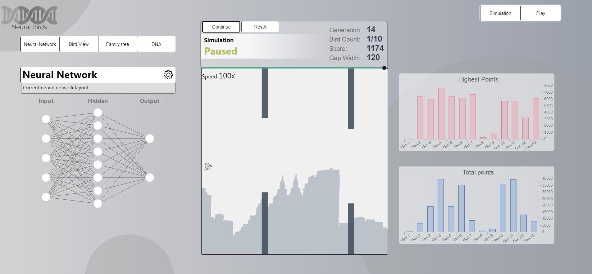

# Neural Birds

Neuroevolution simulator based on the popular flappy bird mobile game. Simulation uses neural networks and genetic algorithms to create optimized birds that survive trough the course. Click [here](https://www.neuralbirds.com/) to test and [here](https://www.youtube.com/watch?v=zGWXS5YHu0w) for video 

## Built With
* React
* Tensorflow.js
* Chart.js

## Simulation
In the setup select initial gap width and number of birds. Lower number of birds means faster performance but changes for creating optimized birds are lower. If the birds won't survive past the first pipes in 20 rounds restart evolution if necessary. Simulation can be speeded up to 100x.

## Evolution
Bird fitness is measured by the distance the bird survives. Highest scoring birds are chosen to the mating pool and are ranked by percentage (individual points/total points) so that the most fitted birds are more likely to pass genes on. 

Each offspring has two parents that are chosen from the pool. Offspring "dna" is combination of its parents neural network weights. In addition offspring has a change of mutating its weights.

## Visuals

* Neural Network
    * Neural network layout visualized
    * Change layout in the settings
* Bird view
    * Bird Input/Output data visualized
* Family tree
    * Select bird from current generation to see its parents and grandparents
    * Each bird is mapped by:
        * ID
        * Fitness
        * Score
    * Additional color option to based on the bird score
  * DNA
    * Neural network weight values visualized in radar chart
    * Updates every time new generation is created

    

